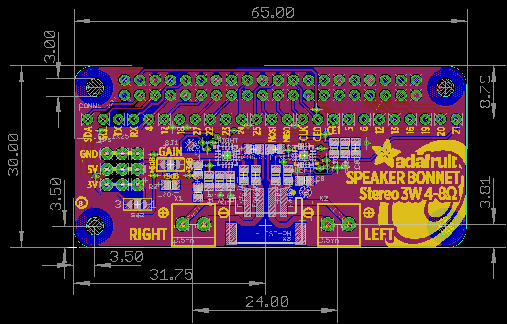
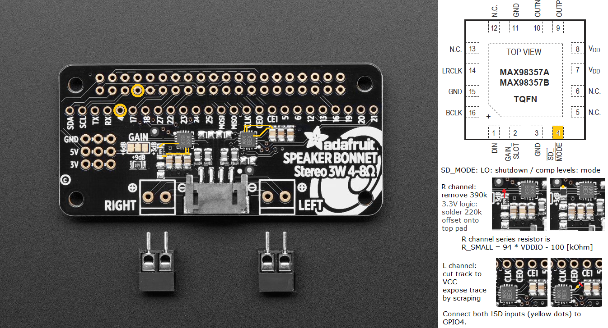

## Adafruit Stereo Speaker Bonnet PCB

<a href="http://www.adafruit.com/products/3346"> 
Click here to purchase one from the Adafruit shop</a>

PCB files for the Adafruit Stereo Speaker Bonnet for Raspberry Pi. Format is EagleCAD schematic and board layout
* http://www.adafruit.com/product/3346

### Description

Hey Mr. DJ! Turn up that Raspberry Pi mix to the max with this cute 3W Stereo Amplifier Bonnet for Raspberry Pi. (It's not big enough to be an official HAT, so we called it a bonnet, you see?) It's the exact same size as a Raspberry Pi Zero but works with any and all Raspberry Pi computers with a 2x20 connector - A+, B+, Zero, Pi 2, Pi 3, etc. We've tested it out with Raspbian (the official operating system) and RetroPie.

This Bonnet uses I2S a digital sound standard, so you get really crisp audio. The digital data goes right into the amplifier so there's no static like you hear from the headphone jack. And it's super easy to get started. Just plug in any 4Ω to 8Ω speakers, up to 3 Watts, run our installer script on any Raspberry Pi, reboot and you're ready to jam!

Each order comes as a fully tested and assembled PCB and 2x extra terminal blocks. No soldering required if you're using our 3 Watt speaker set, just plug and play.

### Updates

#### 2021-11-29 swap left and right channels 

Swap channels on PCB. This impacts only the speakers connected via JST-PH header X3 when replacing the board. The revision is now called "B+". Component coordinates and paste stencil of Rev B can be re-used.

\- HW

#### 2021-11-29 implement shutdown option to fix pop issue

Problem: MAX98357A used here needs to be disabled when no clocks are present to avoid pops during boot.

Fix: Project files have been updated to include an option to connect !SD_MODE inputs to GPIO4. See [current schematic](assets/Adafruit%20Speaker%20Bonnet.sch.pdf).

Modification instructions for previous PCB revision: Below is a description how to modify the older PCB version to implement the fix. R1 (394) needs to be replaced with 220k soldered to one pad only as shown in the crop. the LEFT channel pin 4 trace going to the capacitors needs to be cut near the capacitors. Subsequently, part of the remaining trace is exposed and tinned to form a new pad.  GPIO4, the new pad, as well as the unconnected pad of the 220k resistor need to be connected using thin (<= 0.3 mm) enamel wire or equivalent.

\- HW

### License

Adafruit invests time and resources providing this open source design, please support Adafruit and open-source hardware by purchasing products from [Adafruit](https://www.adafruit.com)!

Designed by Limor Fried/Ladyada for Adafruit Industries.

Creative Commons Attribution/Share-Alike, all text above must be included in any redistribution. See license.txt for additional details.
